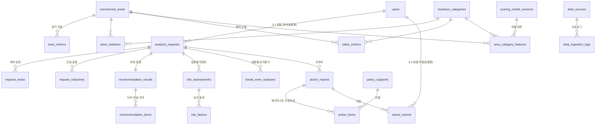

# ERD v2 (DB 설계 개정)

보고서 6.3(ERD v1)을 기준으로 계산 로직 v2 명세서 §9의 변경을 반영했다. 실제 스키마는 `backend/app/models.py`이고, DDL은 [`schema_postgres.sql`](schema_postgres.sql) / [`schema_mysql.sql`](schema_mysql.sql)(모델에서 자동 생성, `python scripts/export_docs.py`).

## 테이블 구성 (27개)

| 분류 | 테이블 | 비고 |
|---|---|---|
| 사용자·분석 요청 | users, analysis_requests, request_areas, request_industries | v1 그대로 + 컬럼 추가. users는 0.2(로그인 제거)부터 새로 쓰지 않고 이전 DB 호환용으로만 남김 |
| 상권·업종 원천 | commercial_areas, business_categories, area_metrics, store_statistics, rent_metrics, sales_metrics, startup_closure_history | 원천 그대로 저장(파생값 저장 안 함) |
| **분기 배치 산출물 [v2]** | **scoring_model_versions, area_category_features** | 배치가 쓰고 API는 조회만 |
| **기준 정보 [v2]** | **category_cost_profiles, industry_licenses, places** | 원가율 근거·면허 업종·지명 사전 |
| 추천·위험도·리포트 결과 | recommendation_results, recommendation_items, risk_assessments, risk_factors, break_even_analyses, action_reports, action_items, policy_supports, saved_reports | 결과 근거까지 저장 |
| 수집 관리 | data_sources, data_ingestion_logs | UC-07 |

## v1 → v2 변경 요약

| 테이블 | 변경 | 이유 |
|---|---|---|
| store_statistics | `substitute_store_count` → **`total_store_count`**(유사_업종_점포_수) + `franchise_count`·`opening_count`·`closure_count`. `density_score`·`new_entry_rate` 삭제 | 원천 검증 결과 '유사 업종 점포 수'는 대체 업종이 아니라 프랜차이즈 포함 전체 점포(=폐업률 분모). 파생값은 특징 테이블로 |
| sales_metrics | `quarterly_sales`·`quarterly_tx_count`(분기 합계 원천) + `breakdown_json`(요일·시간대·성별·연령). 월매출·객단가·증감률 삭제 | '당월_매출_금액'은 분기 합계. 파생값은 배치에서 계산 |
| rent_metrics | `rent_per_3_3m2`(원천: 3.3㎡당 월 환산임대료) 추가, `avg_monthly_rent`는 원천 없음 → NULL | 단위 명시 |
| area_metrics | `base_quarter`, 소득·지출, 영업개월 평균, 상권변화지표 추가 | 원천 컬럼 보존 |
| startup_closure_history | 연 단위 집계 전용(완결된 연도만), `survival_rate_3y`는 원천 없어 NULL | 점포 테이블과 중복 제거 |
| commercial_areas | `area_code`·`area_level`(district/trade_area)·`parent_area_id`·`boundary_geojson` | 자치구 → 상권 단위 확장 대비, 반경 후보 계산 |
| business_categories | `has_sales_data`, `display_group`(SB-04 칩) | 추천 대상 판별 |
| analysis_requests | `public_id`(UUID), `user_type`, 기타 고정비·대출·금리·대표자 인건비·보유 자격·대분류 제한·분야별 원가율(`cogs_json`)·사용자 제외 업종(`excluded_json`), 위치(검색명·좌표·반경), `data_quarter`·`model_version` | v2 입력 + 재현성. 0.2부터 로그인이 없어 새 분석은 user_id·claim_token_hash가 늘 NULL(0.1 회원 분석만 값이 있고 열람하지 않음) |
| recommendation_results | `model_version`, `weights_json`, `f_applied`·`f_note`, `n_candidates` | 어떤 가중치로 계산했는지 기록 |
| recommendation_items | `item_type`(TOP/INTEREST/CAUTION), D·S·F 점수, 달성배율, 제외 사유, `detail_json` | 관심·주의 업종도 저장 |
| risk_assessments | `area_id`, `pred_annual_rate`, `location_risk_pct/level`, `confidence`, `model_version`, `reference_json` | 두 축 위험도 + 참고 지표 |
| risk_factors | `factor_score`·`max_score`(임의 배점) → **`factor_code`·`label`·`effect_pct`·`x_value`** | 모델 요인 효과(%)로 설명 |
| break_even_analyses | `category_id`, 기타 고정비·감가상각·카드수수료·원가율·영업일·달성배율·비용압박·회수개월, 입력/결과 JSON | v2 손익분기 |
| action_reports | `public_id`, `break_even_id`, `category_id`, `policy_ctx_json` | 리포트가 어떤 손익분기를 반영했는지, 지원사업을 고른 근거(업종 분야·종합 위험·적자 여부·대출 권유 가능) |
| action_items | `is_done`(체크리스트 완료 표시) | 저장한 리포트를 다시 열어도 체크 상태 유지(SB-08·09) |
| saved_reports | **`device_key_hash`**(0.2): 브라우저 저장 키(`X-Device-Key`)의 SHA-256, `(device_key_hash, report_id)` 중복 방지, `user_id`는 NULL 허용(0.1 회원 저장만 값) | 로그인 없이 브라우저마다 저장 목록(SB-09). 0.1 DB는 서버 시작 시 자동 변환(`app/db.py` `migrate`) |
| policy_supports | `provider`, `target_user`, `summary`, `checked_at` | 대상 매칭·정보 확인일 |
| data_sources / logs | `dataset_code`·`url`·`file_name` / `max_quarter` | 출처 추적 |

## 핵심 관계



## 데이터 흐름

```
CSV(data_raw) ──ingest.py──▶ 원천 테이블(store/sales/area/rent_metrics …) + data_ingestion_logs
                                 │
                     features_batch.py (분기 1회)
                                 ▼
             scoring_model_versions(계수·c_t·기준분위) + area_category_features(지역×업종 특징·예측)
                                 │  (API 시작 시 메모리 적재)
                                 ▼
  요청: analysis_requests → recommendation_* → risk_* → break_even_analyses → action_* → saved_reports
```

- 배치 모델은 DB 원천만으로 학습하며, 명세서 백테스트 모델(CSV 직접 학습)과 계수·점수가 비트 단위로 같다(`tests/test_api.py::test_db_trained_model_matches_csv_engine`).
- 모델 버전 이름은 `risk-v2.1@20252`(알고리즘 버전@데이터 기준 분기). 분석 요청에 버전을 남기므로, 데이터 갱신 뒤 예전 분석을 열면 "데이터가 갱신됐어요" 안내가 뜬다.
