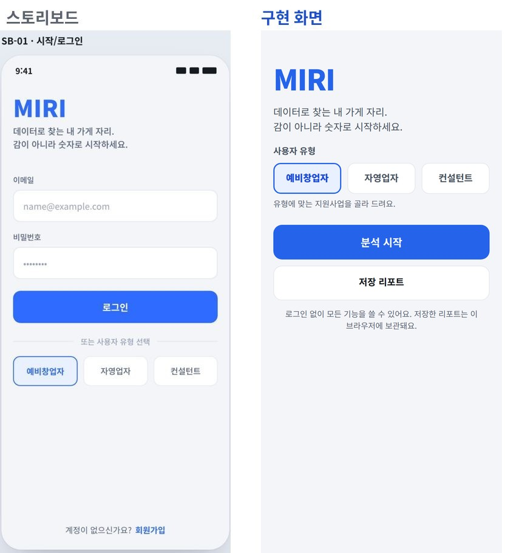
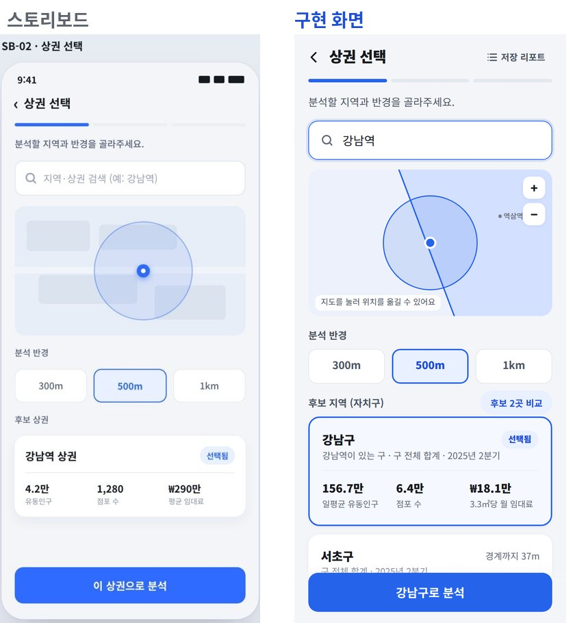
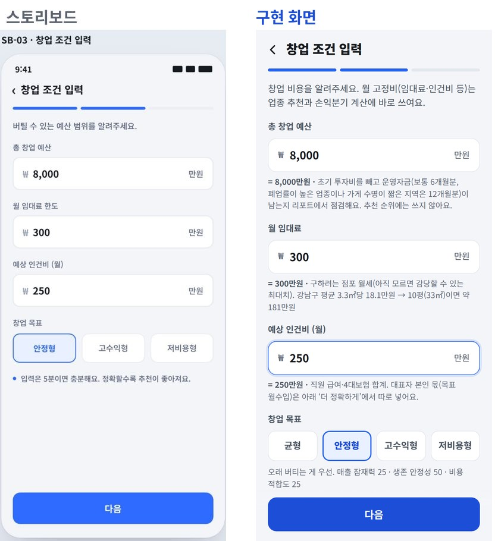
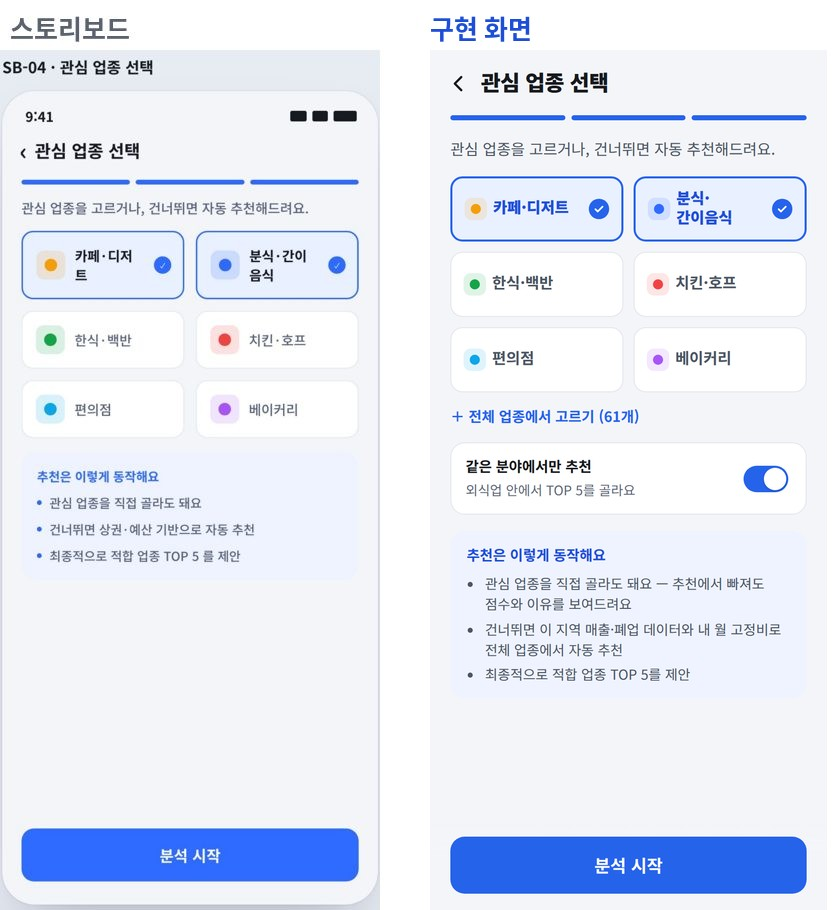
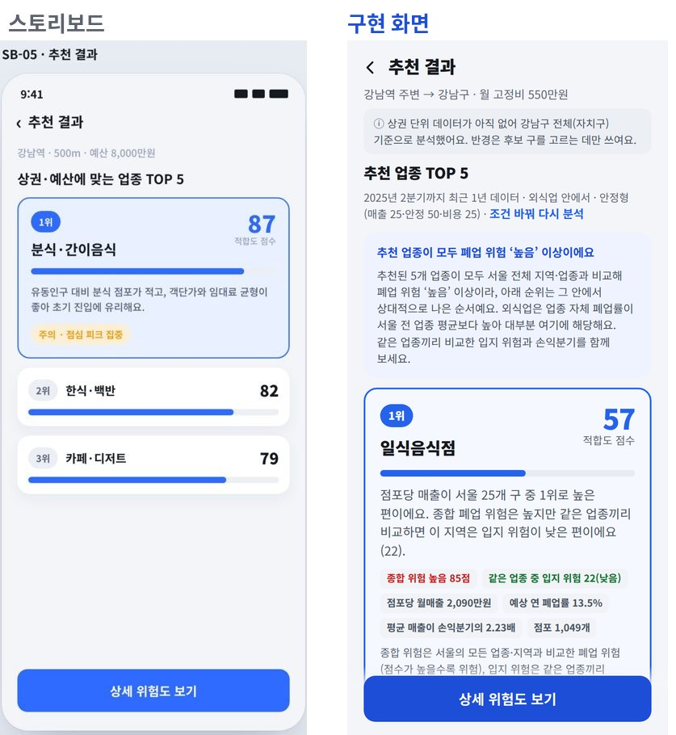
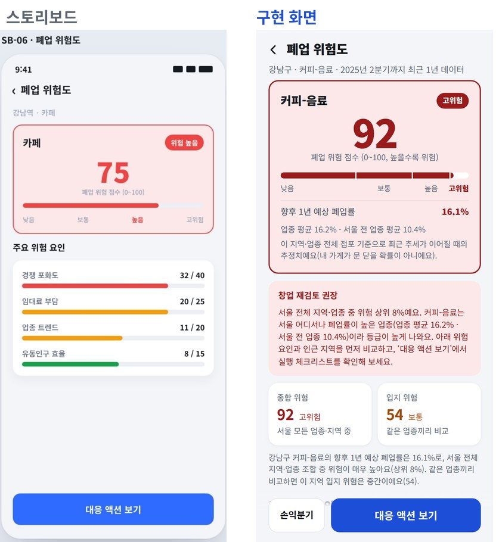
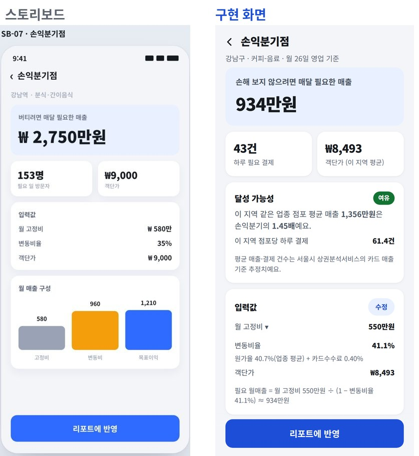
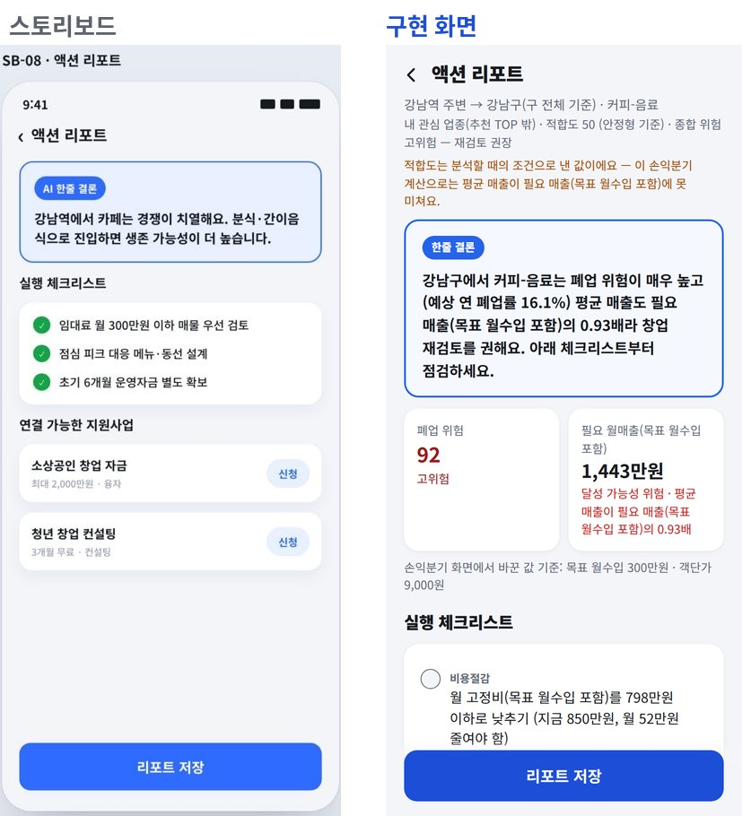
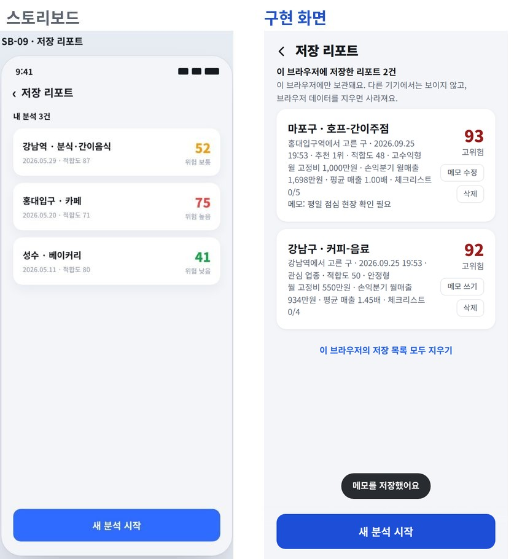

# 화면 구현 대응표 (스토리보드 SB-01~09)

왼쪽은 보고서 6.4.4 스토리보드, 오른쪽은 실제 구현 화면(모바일 390×844, 실데이터로 E2E 테스트 중 캡처)이다. 캡처 시나리오: 시작(로그인 없음, 예비창업자) → 강남역 500m → 예산 8,000만·임대료 300만·인건비 250만·안정형 → 관심 업종 카페·디저트, 분식·간이음식 → 결과·위험도·손익분기(목표 월수입 300만, 객단가 9,000원으로 수정) → 리포트 → 바로 저장 → 이 브라우저의 저장 목록.

| SB | 파일 | 스토리보드 대비 달라진 점 |
|---|---|---|
| 01 | `screens/Start.tsx` | **로그인·회원가입 없음(0.2)**: 이메일·비밀번호 칸을 없애고 사용자 유형 칩(지원사업 매칭) + '분석 시작'·'저장 리포트'만. 저장 리포트는 계정 대신 이 브라우저에 보관 |
| 02 | `screens/AreaSelect.tsx`, `components/SeoulMap.tsx` | 지도는 자치구 경계 벡터 지도(타일 없음·지도 탭으로 위치 이동). 후보 카드 지표는 **일평균 유동인구 · 점포 수 · 3.3㎡당 월 임대료**(원천 단위 그대로). 상권 단위 데이터 전이라 반경에 걸친 **자치구**가 후보로 나오고 안내 문구 표시 |
| 03 | `screens/Conditions.tsx` | 창업 목표 칩 아래 실제 가중치 표시(안정형 = 매출 25·안정 50·비용 25). '더 정확하게(선택)'에 초기 투자비·기타 고정비·대표자 목표 월수입·대출·보유 자격 추가(v2 입력). 임대료 칸에 이 지역 10평 환산 임대료 힌트 |
| 04 | `screens/Interests.tsx` | 6개 칩 + '전체 업종에서 고르기(61개 — 매출을 비교할 지역이 5곳 이상인 업종)'. **같은 분야에서만 추천** 스위치(기본 켬: 관심 업종이 외식업이면 외식업 안에서 TOP 5) |
| 05 | `screens/Results.tsx` | 1위 카드 펼침 + 근거 두 문장 + 숫자 칩(종합 위험·같은 업종 중 입지 위험·배율, 원가율을 모르면 '손익분기 미확인') + 유의 알약(예: 점심 피크 집중) + 적합도 구성 설명. 관심 업종 섹션, 주의 업종(입지 위험 상위 10%) 접기 목록, 계산 안내(대형 점포·적합도 20점 미만으로 뺀 업종 포함) |
| 06 | `screens/Risk.tsx` | **v2 반영**: v1의 '경쟁 포화도 32/40' 배점 → 요인별 **예상 폐업률 효과(+56%, −2%)**. 종합 위험·입지 위험 두 축, 향후 1년 예상 폐업률(업종·서울 평균 대비), 고위험이면 '창업 재검토 권장', 더 안전한 인근 지역, 참고 지표(점수 미반영) |
| 07 | `screens/BreakEven.tsx` | **v2 반영**: 26일 영업, 원가율+카드수수료로 변동비율, **달성 가능성**(지역 평균 매출 ÷ 손익분기, 여유/보통/빠듯/위험), 투자 회수 개월. 막대 '목표이익' = 대표자 목표 월수입. 입력값 수정 시트 |
| 08 | `screens/ActionReport.tsx` | 한줄 결론은 계산 결과로 만든 문장(M-06 규칙, 명세서 11절). 체크리스트는 자격·손익분기·임대료·상위 위험 요인·대형 점포·매출 시간대·운영자금에서 생성(탭하면 완료 표시). 지원사업은 실제 사업·대상(예비창업자·자영업자)·신청 링크(조건은 공고 확인 안내) |
| 09 | `screens/SavedReports.tsx` | 카드: 구 · 업종 / 고른 장소 · 저장일 · 추천 상태(추천 N위·관심·주의) · 적합도 · 창업 목표 / 월 고정비 · 반영한 손익분기 · 체크리스트 진행 / 위험 점수(등급 색). 메모(세 줄까지 표시)·삭제(확인 시트). 로그인이 없어 '이 브라우저에 저장한 리포트'로 표시(다른 기기에서는 보이지 않음). 여럿이 쓰는 컴퓨터용 '이 브라우저의 저장 목록 모두 지우기'(확인 시트, 이 탭의 입력값도 정리 — 로그아웃 대신). 저장소를 못 쓰는 브라우저(새로고침하면 목록이 사라짐)·0.1 계정 사용자(예전 계정 저장분은 안 보임)에게 안내 |

## SB-01 시작

## SB-02 상권 선택

## SB-03 창업 조건 입력

## SB-04 관심 업종 선택

## SB-05 추천 결과

## SB-06 폐업 위험도

## SB-07 손익분기점

## SB-08 액션 리포트

## SB-09 저장 리포트

## 예외 처리 흐름(보고서 6.1.4) 구현 위치

| 예외 | 처리 | 코드 |
|---|---|---|
| 상권 데이터 부족 | 인근 지역으로 대체 분석 + 안내 / 업종 점포 없음 → 서울 같은 업종 평균 조건으로 위험도 계산(신뢰도 낮음) | `analysis.run_analysis`, `risk_svc.fallback_row` |
| 필수 입력값 누락 | 화면 검증 + API 422(항목별 한국어 메시지) | `Conditions.tsx`, `errors.py` |
| 추천 가능 업종 부족 | 가능한 업종만 표시 + "N개예요" 안내 | `analysis.run_analysis` |
| 위험도 과도하게 높음 | 고위험 → '창업 재검토 권장' + 대안 업종·입지 | `Risk.tsx`, `report_svc` |
| 외부 데이터 갱신 실패 | 파일별 실패 로그, 기존 데이터 유지, 화면에 "이전 데이터로 분석" 안내 | `ingest.run_ingestion`, `engine._ingestion_notices` |
